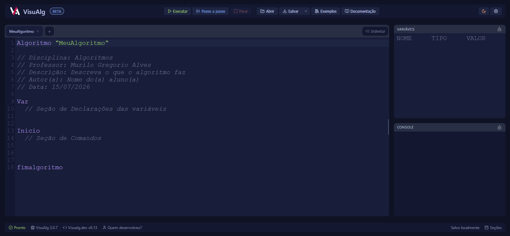

# VisuAlg Web

IDE web para escrever, executar e depurar algoritmos em pseudocodigo no estilo do VisuAlg 3.0.7, com editor de codigo, console integrado, painel de variaveis e execucao passo a passo.
Teste o app: [gregorioalves.com/visualg](https://gregorioalves.com/visualg/)

Este projeto não é o VisuAlg original nem o VisuAlg.dev. O VisuAlg Web é um fork do VisuAlg.dev, do qual herdou a base do editor e do interpretador antes de receber identidade, políticas, testes e alterações próprias. Ambos fazem parte de uma história maior, construída por professores, desenvolvedores, materiais didáticos e iniciativas anteriores.



Esta versão `0.14.0` dá continuidade à linha iniciada na `0.10` a partir de um
fork do projeto **VisuAlg.dev**. A nova identidade
evita confundir este produto com a aplicação de origem e preserva seus créditos
no [histórico do projeto](src/docs/historia.md).

O **VisuAlg Web é mantido por Murilo Gregorio Alves**. Dúvidas, suporte,
propostas e assuntos sobre este fork devem ser encaminhados pelos
[canais oficiais do projeto](CONTACT.md), não aos autores e professores citados
como referência histórica.

O projeto possui duas saidas a partir da mesma fonte:

- Web: roda a interface de `src/` no navegador.
- Desktop: empacota a mesma interface com Electron Forge e Vite.

O alvo pratico e manter a experiencia o mais proxima possivel do VisuAlg 3.0.7.
A [matriz de compatibilidade](src/docs/compatibilidade.md) define o comportamento
da linguagem; o [status consolidado](src/docs/status.md) mostra separadamente o
que ja foi corrigido e o que ainda esta pendente.

## Status do projeto

Para evitar listas concorrentes, existe uma unica fonte para acompanhamento:

- **[Status, correcoes e pendencias](src/docs/status.md):** estado atual,
  evidencias, limitacoes conhecidas e criterios de conclusao.
- **[Compatibilidade da linguagem](src/docs/compatibilidade.md):** sintaxe e
  recursos que fazem parte do contrato funcional atual.
- **[Politica de compatibilidade](COMPATIBILITY.md):** regras para corrigir ou
  alterar esse contrato.
- **[Checklist de release](RELEASE_CHECKLIST.md):** procedimento de publicacao;
  caixas desmarcadas nele nao significam automaticamente bugs em aberto.

No aplicativo, a mesma fonte abre pela aba **Documentacao > Status**, pelo selo
**Beta** ou pela versao exibida no rodape.

Novos relatos devem ser abertos como issues reproduziveis. Depois de confirmados,
eles entram no documento de status com identificador e criterio de conclusao.

## Recursos

- Editor baseado em CodeMirror 5 com destaque de sintaxe para VisuAlg.
- Template inicial de algoritmo em portugues.
- Multiplas abas com renomeacao automatica pelo nome do algoritmo.
- Execucao completa com `F9` e execucao passo a passo com `F8`.
- Realce da linha atual durante a execucao passo a passo.
- Console integrado com entrada por campo inline ou modal.
- Painel de variaveis com nome, tipo e valor.
- Abertura de arquivos `.alg` e `.txt`.
- Salvamento do codigo como `.alg` ou `.txt`.
- Persistencia automatica das abas e dos codigos no armazenamento local do navegador/Electron.
- Indicador visivel de autosave e restauracao de uma copia de recuperacao.
- Onboarding de primeira visita e galeria de exemplos executaveis.
- Erros clicaveis com navegacao direta para a linha e coluna no editor.
- Menu persistente para mostrar ou esconder editor, variaveis e console.
- Autoindentacao do codigo.
- Comentario/descomentario com `Ctrl+/` ou `Cmd+/`.
- Temas escuro, claro e alto contraste.
- Configuracoes persistidas no `localStorage`.
- Deteccao de possivel loop infinito apos 1.000 iteracoes, com opcao de continuar ou parar.

## Linguagem suportada

O interpretador roda no cliente, em JavaScript, e cobre estruturas de programa,
tipos, vetores, entrada e saida, condicionais, repeticoes, subprogramas,
operadores, funcoes internas e comandos especiais usados no VisuAlg.

Para que este resumo nao volte a divergir do runtime, a lista detalhada e
mantida somente na [matriz de compatibilidade](src/docs/compatibilidade.md). Ela
tambem explica as adaptacoes de plataforma e as extensoes proprias do Web.

Exemplo:

```alg
Algoritmo "Soma"

Var
  a, b, resultado: inteiro

Inicio
  escreva("Digite o primeiro numero: ")
  leia(a)

  escreva("Digite o segundo numero: ")
  leia(b)

  resultado <- a + b
  escreval("Resultado: ", resultado)
fimalgoritmo
```

## Estrutura do projeto

```text
.
|-- src/
|   |-- index.html
|   |-- js/
|   |   |-- editor.js
|   |   |-- interpreter.js
|   |   |-- main.js
|   |   |-- tabs.js
|   |   |-- terminal.js
|   |   |-- variables.js
|   |   `-- docs.js
|   |-- css/
|   |-- images/
|   |-- jsdelivr/
|   |-- unpk/
|   `-- vendor/
|-- electron/
|   |-- main.js
|   `-- preload.js
|-- forge.config.js
|-- package.json
|-- package-lock.json
|-- vite.main.config.mjs
|-- vite.preload.config.mjs
`-- vite.renderer.config.mjs
```

`src/` e a fonte unica da interface. O Electron apenas carrega/empacota essa mesma interface por meio de `electron/` e das configuracoes Vite/Forge da raiz.

## Rodando a versao web

Instale as dependencias, se necessario:

```bash
npm install
```

Inicie o servidor web de desenvolvimento:

```bash
npm run dev:web
```

Depois acesse a URL indicada pelo Vite, normalmente:

```text
http://localhost:5173
```

Para gerar uma build estatica:

```bash
npm run build:web
```

Tambem e possivel servir `src/` diretamente sem build:

```bash
python -m http.server 8080 -d src
```

## Rodando a versao desktop

Instale as dependencias, se necessario:

```bash
npm install
```

Inicie em modo desenvolvimento:

```bash
npm start
```

Gere um pacote local:

```bash
npm run package
```

Gere instaladores conforme os makers configurados no Electron Forge:

```bash
npm run make
```

Durante o desenvolvimento, a janela Electron abre o DevTools automaticamente. Em builds empacotadas, o DevTools nao e aberto por padrao.

## Anexo: Documentacao interna

O modal de documentacao carrega arquivos Markdown via `docs.js`, nos caminhos:

- [`src/docs/introducao.md`](src/docs/introducao.md): primeiros passos e regras gerais.
- [`src/docs/status.md`](src/docs/status.md): correcoes, pendencias e validacoes atuais.
- [`src/docs/compatibilidade.md`](src/docs/compatibilidade.md): contrato funcional da linguagem.
- [`src/docs/operadores.md`](src/docs/operadores.md)
- [`src/docs/entrada-saida.md`](src/docs/entrada-saida.md)
- [`src/docs/condicionais.md`](src/docs/condicionais.md)
- [`src/docs/repeticao.md`](src/docs/repeticao.md)
- [`src/docs/subprogramas.md`](src/docs/subprogramas.md)
- [`src/docs/funcoes.md`](src/docs/funcoes.md)
- [`src/docs/comandos.md`](src/docs/comandos.md)
- [`src/docs/historia.md`](src/docs/historia.md): historia e autoria do projeto.

Esses arquivos estao em `src/docs/` e sao copiados para a build web por `vite.renderer.config.mjs`, mantendo a mesma documentacao na versao web e no empacotamento Electron.

`docs/historia.md` e o anexo historico do projeto. Ele conta a origem do VisuAlg, o caminho ate esta base web e o lugar que a manutencao atual ocupa nessa linha de continuidade.

## Principais arquivos

- `src/js/interpreter.js`: lexer, parser e executor do pseudocodigo.
- `src/js/editor.js`: configuracao do CodeMirror e modo de sintaxe VisuAlg.
- `src/js/main.js`: inicializacao da UI, execucao, configuracoes, abrir/salvar arquivos e atalhos.
- `src/js/tabs.js`: gerenciamento de abas.
- `src/js/terminal.js`: console e leitura de entradas.
- `src/js/variables.js`: renderizacao do painel de variaveis.
- `electron/main.js`: processo principal do Electron.
- `electron/preload.js`: preload do Electron.
- `forge.config.js`: empacotamento com Electron Forge.

## Suporte, bugs e governança

- Contato principal e responsabilidades: [`CONTACT.md`](CONTACT.md).
- Bugs reproduzíveis: [abra um relato pelo formulário do projeto](https://github.com/Gregorio-A/visualg-web/issues/new?template=bug_report.yml).
- Contribuições: [`CONTRIBUTING.md`](CONTRIBUTING.md).
- Governança e tomada de decisões: [`GOVERNANCE.md`](GOVERNANCE.md).
- Padrões de convivência: [`CODE_OF_CONDUCT.md`](CODE_OF_CONDUCT.md).
- Vulnerabilidades: use somente o canal privado descrito em [`SECURITY.md`](SECURITY.md).
- Navegadores e sistemas suportados: [`SUPPORT.md`](SUPPORT.md).
- Estado atual, correcoes e pendencias: [`src/docs/status.md`](src/docs/status.md).
- Compromissos de linguagem e mudanças incompatíveis: [`COMPATIBILITY.md`](COMPATIBILITY.md).
- Tratamento e armazenamento de dados: [`PRIVACY.md`](PRIVACY.md).
- Processo de publicação: [`RELEASE_CHECKLIST.md`](RELEASE_CHECKLIST.md).

Ao relatar um bug, informe versão, ambiente, passos, resultado esperado e um
programa `.alg` mínimo. Não publique segredos ou dados pessoais.

## Desenvolvimento

Para executar o lint de corretude sobre a interface, Electron e testes:

```bash
npm run lint
```

Para instalar os navegadores e executar os testes reais da interface:

```bash
npx playwright install chromium firefox chrome msedge
npm run test:e2e
```

Para uma verificação local mais rápida somente no Chromium:

```bash
npm run test:e2e:chromium
```

O workflow [`.github/workflows/ci.yml`](.github/workflows/ci.yml) executa lint,
regressões e build, além da suíte E2E no Chrome, Edge e Firefox.

Contribuições são bem-vindas. Antes de abrir um pull request, leia o
[`CONTRIBUTING.md`](CONTRIBUTING.md) e confirme que os testes relacionados à
mudança passam localmente.

Para validar programas padrao sem abrir a interface, use a ferramenta interna:

```bash
npm run test:standard
```

Para validar a matriz de compatibilidade legada e todas as funções internas:

```bash
npm run test:compat
```

Para executar os programas publicados na galeria de exemplos:

```bash
npm run test:examples
```

Para validar o isolamento Electron, os canais IPC e a proteção do comando
`arquivo` contra travessia e links simbólicos:

```bash
npm run test:security
```

Ela executa a lista em `scripts/standard-programs.js` e compara a saida do interpretador com os resultados esperados. O `npm run test:p0` tambem roda essa validacao junto da regressao principal.

Antes de publicar uma nova versão, siga o
[`RELEASE_CHECKLIST.md`](RELEASE_CHECKLIST.md). O `npm run test:p0` inclui as
regressões da linguagem, workspace, exemplos e segurança Electron.

## Licenca

Distribuído sob a licença MIT. Consulte [`LICENSE`](LICENSE).
